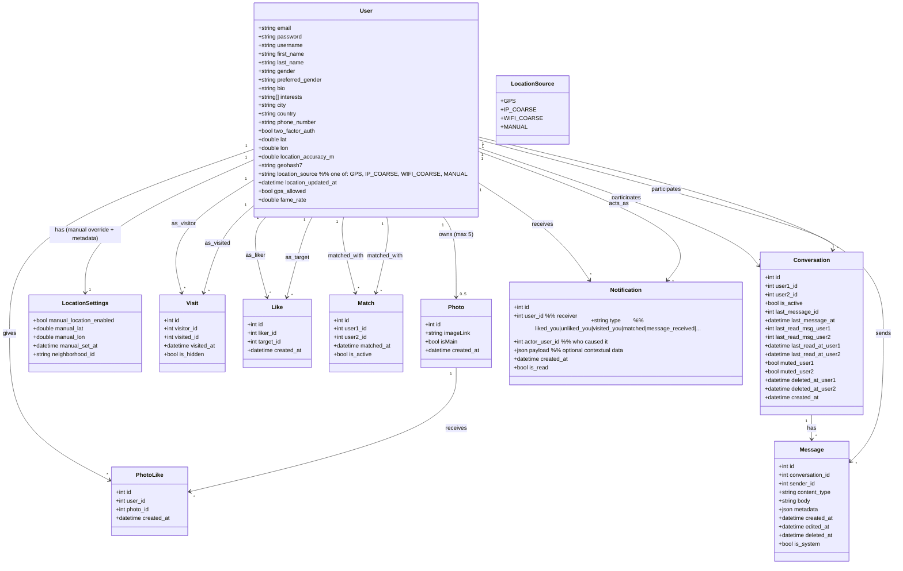

```mermaid
classDiagram
%% =======================
%% Associations
%% =======================

User "1" --> "0..5" Photo : owns (max 5)
User "1" --> "1" LocationSettings : has (manual override + metadata)

%% Visits: directed, many events per pair
User "1" --> "*" Visit : as_visitor
User "1" --> "*" Visit : as_visited

%% User-level likes (drive connection)
User "1" --> "*" Like : as_liker
User "1" --> "*" Like : as_target

%% Optional gallery likes (cosmetic only)
User "1" --> "*" PhotoLike : gives
Photo "1" --> "*" PhotoLike : receives

%% Matches (derived/cache from mutual user-level likes)
User "1" --> "*" Match : matched_with
User "1" --> "*" Match : matched_with

%% 1:1 Chat (no participants table)
User "1" --> "*" Conversation : participates
User "1" --> "*" Conversation : participates
Conversation "1" --> "*" Message : has
User "1" --> "*" Message : sends

%% In-app notifications (append-only)
User "1" --> "*" Notification : receives
User "1" --> "*" Notification : acts_as


%% =======================
%% Core classes
%% =======================
class User {
  +string email
  +string password
  +string username
  +string first_name
  +string last_name
  +string gender
  +string preferred_gender
  +string bio
  +string[] interests
  +string city
  +string country
  +string phone_number
  +bool two_factor_auth

  %% Location snapshot (current for proximity/matching)
  +double lat
  +double lon
  +double location_accuracy_m
  +string geohash7
  +string location_source  %% one of: GPS, IP_COARSE, WIFI_COARSE, MANUAL
  +datetime location_updated_at

  +bool gps_allowed
  +double fame_rate
}

class Photo {
  +int id
  +string imageLink
  +bool isMain
  +datetime created_at
}

%% Enumeration (as class with constants for Mermaid)
%% LocationSource: GPS | IP_COARSE | WIFI_COARSE | MANUAL
class LocationSource {
  +GPS
  +IP_COARSE
  +WIFI_COARSE
  +MANUAL
}

class LocationSettings {
  %% Manual override & neighborhood metadata
  +bool manual_location_enabled
  +double manual_lat
  +double manual_lon
  +datetime manual_set_at
  +string neighborhood_id
}

class Visit {
  +int id
  +int visitor_id
  +int visited_id
  +datetime visited_at
  +bool is_hidden
}

%% User-level like (only this counts for connection)
class Like {
  +int id
  +int liker_id
  +int target_id
  +datetime created_at
}

%% Optional: per-photo like (cosmetic, NOT for connection)
class PhotoLike {
  +int id
  +int user_id
  +int photo_id
  +datetime created_at
}

%% Mutual connection (derived/cache)
class Match {
  +int id
  +int user1_id
  +int user2_id
  +datetime matched_at
  +bool is_active
}

%% Chat (1:1)
class Conversation {
  +int id
  +int user1_id
  +int user2_id
  +bool is_active
  +int last_message_id
  +datetime last_message_at

  %% per-user state (mirror fields)
  +int last_read_msg_user1
  +int last_read_msg_user2
  +datetime last_read_at_user1
  +datetime last_read_at_user2
  +bool muted_user1
  +bool muted_user2
  +datetime deleted_at_user1
  +datetime deleted_at_user2

  +datetime created_at
}

class Message {
  +int id
  +int conversation_id
  +int sender_id
  +string content_type
  +string body
  +json metadata
  +datetime created_at
  +datetime edited_at
  +datetime deleted_at
  +bool is_system
}

%% In-app notification (separate from push)
class Notification {
  +int id
  +int user_id        %% receiver
  +string type        %% liked_you|unliked_you|visited_you|matched|message_received|...
  +int actor_user_id  %% who caused it
  +json payload       %% optional contextual data
  +datetime created_at
  +bool is_read
}


%% =======================
%% Notes / constraints
%% =======================
%% note right of Photo
%%   Constraints:
%%   - User may have 0..5 photos
%%   - Exactly one isMain=true if any photo exists
%% end note

%% note right of Like
%%   Rules:
%%   - Only allowed if liker and target both have a profile picture
%%   - Drives "who liked me" and connection state
%%   - UNIQUE(liker_id, target_id)
%% end note

%% note right of Match
%%   Lifecycle:
%%   - Activate when mutual user-level likes exist
%%   - Deactivate on un-like or block
%%   - Store user1_id < user2_id to enforce uniqueness
%% end note

%% note right of Conversation
%%   1:1 only:
%%   - No participants table
%%   - Mirror per-user state as columns
%%   - Disable chat when match inactive or on block
%% end note

%% note right of Notification
%%   Append-only:
%%   - In-app feed; independent from push
%%   - Old notifications remain even if like/match state changes
%% end note

```
